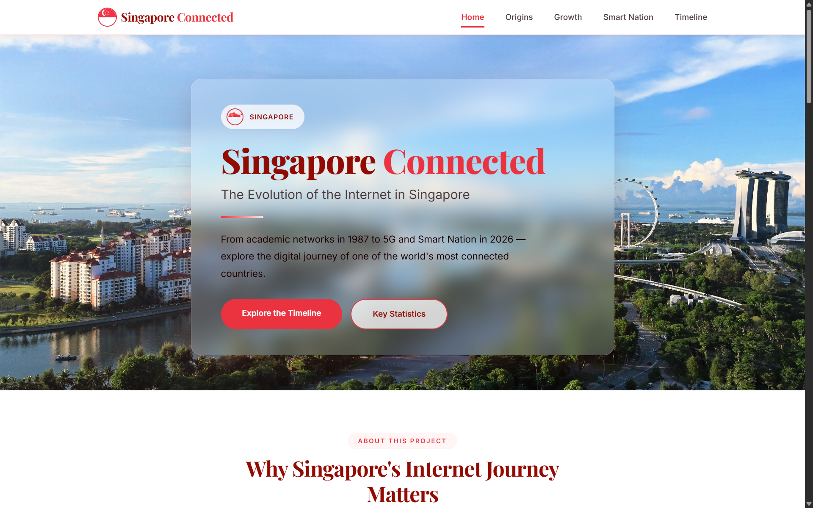
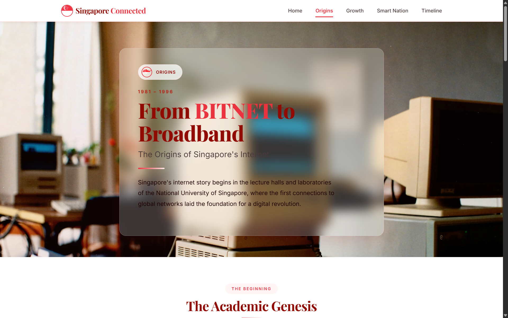
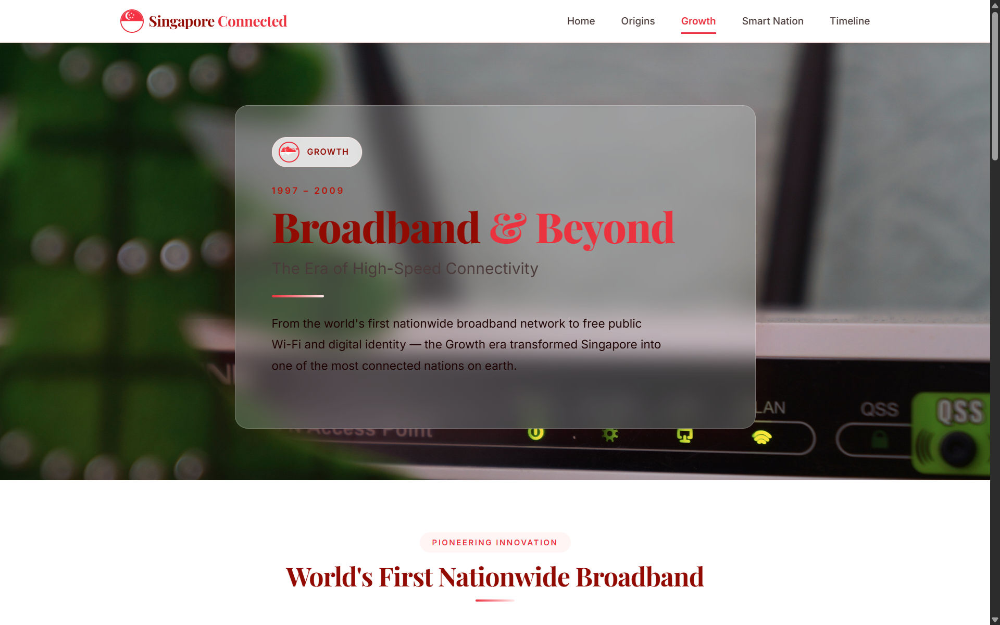
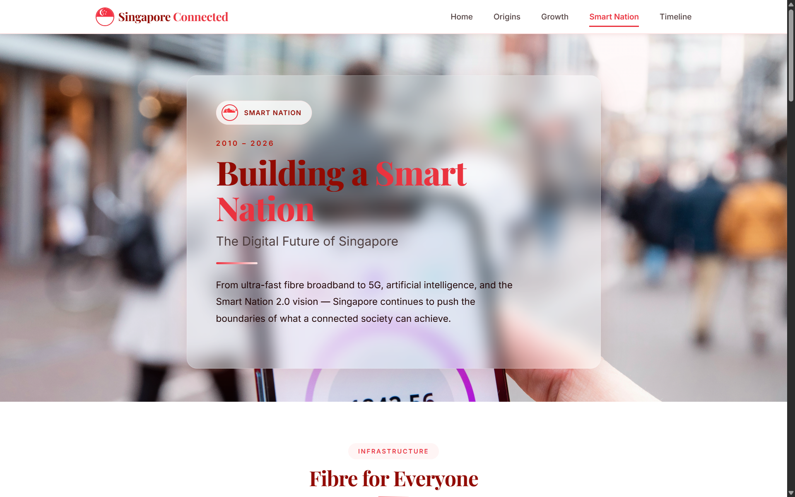
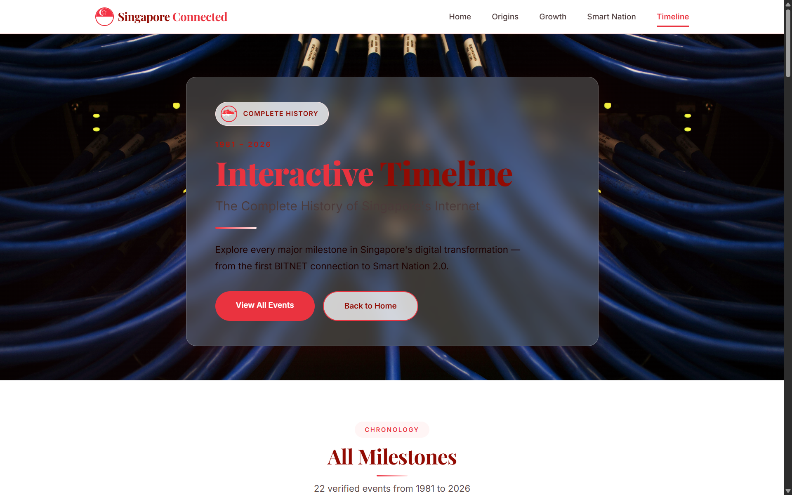
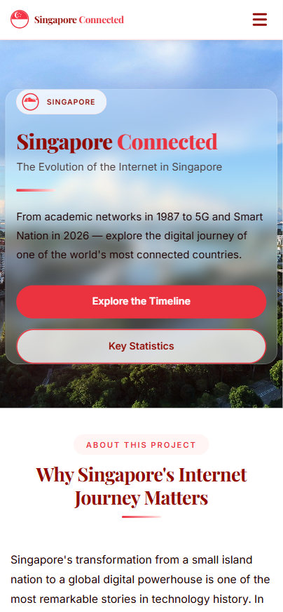

<div align="center">


[](https://git.io/typing-svg)

<br/>

[](https://developer.mozilla.org/en-US/docs/Web/HTML)
[](https://developer.mozilla.org/en-US/docs/Web/CSS)
[](https://developer.mozilla.org/en-US/docs/Web/JavaScript)
[](https://www.json.org/)
[](https://pages.github.com/)

<br/>

[]()
[]()
[]()
[]()
[]()

<br/>

> **🌐 Singapore Connected** — An educational website tracing Singapore's internet history from the National Computer Board in 1981 to 5G and Smart Nation 2.0 in 2026, with dynamic JSON-driven content and a fully responsive red and white design inspired by the Singapore flag.

<br/>

[🚀 Live Demo](#-live-demo) &nbsp;•&nbsp; [📂 Project Structure](#-project-structure) &nbsp;•&nbsp; [🛠️ Setup](#%EF%B8%8F-setup--deployment) &nbsp;•&nbsp; [📸 Screenshots](#-screenshots) &nbsp;•&nbsp; [📊 Features](#-features) &nbsp;•&nbsp; [👤 Student](#-student) &nbsp;•&nbsp; [📄 License](#-license)

</div>

---

<div align="center">

## 🏆 Why Singapore Connected?

</div>

```
Traditional History Websites     →   Static pages, hardcoded content, no interactivity
Singapore Connected               →   Dynamic JSON-driven timeline, responsive, accessible, interactive
```

<table align="center">
<tr>
<td align="center" width="200">

<br/><b>5 Pages</b>
<br/><sub>Home · Origins · Growth · Smart Nation · Timeline</sub>
</td>
<td align="center" width="200">

<br/><b>JSON-Driven</b>
<br/><sub>Dynamic content via template engine</sub>
</td>
<td align="center" width="200">

<br/><b>Responsive</b>
<br/><sub>Desktop · Tablet · Mobile</sub>
</td>
<td align="center" width="200">

<br/><b>Accessible</b>
<br/><sub>WCAG AA · Semantic HTML · ARIA</sub>
</td>
</tr>
</table>

---

## 🌟 Project Overview

**Singapore Connected** is a 5-page educational website that documents the evolution of the Internet in Singapore from 1981 to 2026. Built as part of the **CM1040 Web Development** coursework, this project demonstrates:

- 🎯 **Dynamic content rendering** using JSON data and a custom JavaScript template engine
- 📱 **Fully responsive design** (desktop, tablet, mobile)
- ♿ **WCAG AA accessibility** compliance (90/100 Lighthouse score)
- 🧹 **Clean, well-organised code** with semantic HTML5, CSS3, and ES6 JavaScript
- ✅ **JSON validation** before rendering dynamic content

> 🎓 **Institution:** Singapore Institute of Management (SIM)  
> 📅 **Academic Year:** 2025–2026  
> 🧠 **Module:** CM1040 Web Development  
> 🌍 **Country:** Singapore

---

## 🚀 Live Demo

🔗 **View the live website:** [https://varungiri970-jpg.github.io/singapore-connected/](https://varungiri970-jpg.github.io/singapore-connected/)

---

## ✨ Feature Highlights

<details>
<summary><b>📄 5 Comprehensive Pages</b></summary>

| Page | Title | Period | Focus |
|------|-------|--------|-------|
| Home | Singapore Connected | Overview | Introduction, stats, timeline preview |
| Origins | From BITNET to Broadband | 1981–1996 | Academic networks, first ISPs, IT2000 |
| Growth | Broadband & Beyond | 1997–2009 | Singapore ONE, wireless, Singpass |
| Smart Nation | Building a Smart Nation | 2010–2026 | Fibre, Smart Nation, 5G, AI |
| Timeline | Interactive Timeline | 1981–2026 | All 22 milestones in one view |

</details>

<details>
<summary><b>📊 Dynamic JSON-Driven Content</b></summary>

- **Timeline** (`timeline.json`) — 22 verified milestones with full source citations
- **Statistics** (`statistics.json`) — 4 key metrics
- **Milestones** (`milestones.json`) — 10 featured events
- Custom JavaScript template engine (`renderer.js`)
- JSON validation before rendering (`validator.js`)

</details>

<details>
<summary><b>🎨 Design System (Singapore Flag Colors)</b></summary>

- **White Foundation** — `#FFFFFF` background with `#1A0000` dark text
- **Singapore Red** — `#E02A3E` (headlines, CTAs, highlights)
- **Dark Red** — `#8B0000` (footer, secondary accents)
- **Subtle Pink Background** — `#FFF5F5` (alt sections)
- **Glassmorphism** hero panels — `backdrop-filter: blur(16px)` for text readability
- **Playfair Display** headings + **Inter** body typography (Google Fonts)

</details>

<details>
<summary><b>♿ Accessibility & Usability</b></summary>

- Semantic HTML5 (`<header>`, `<nav>`, `<main>`, `<section>`, `<footer>`)
- ARIA labels (`aria-label`, `aria-expanded`, `aria-controls`)
- Keyboard navigation with visible focus states
- WCAG AA contrast (≥ 4.5:1)
- Reduced motion media query
- Touch-friendly controls (44px+ targets)

</details>

<details>
<summary><b>📱 Fully Responsive</b></summary>

- **Desktop** — ≥1024px (multi-column, horizontal nav)
- **Tablet** — 768–1023px (2-column grid)
- **Mobile** — <768px (single-column, hamburger nav)
- Flexible layouts, responsive typography, fluid images

</details>

---

## 👥 User Testing & Feedback

Five users tested the website. All rated navigation **5/5**.

| User | Device | Feedback |
|------|--------|----------|
| User 1 | Desktop | Clear about internet history |
| User 2 | Mobile | More visuals on homepage suggested |
| User 3 | Mobile | "Good design, no changes required" |
| User 4 | Desktop | "Clean design" |
| User 5 | Mobile | Design good, content could be clearer |

**Actions taken:**
- Added glassmorphism overlay for better text readability
- Enhanced homepage with statistics preview
- Improved hero content clarity
- Adjusted contrast for WCAG AA compliance

📝 **Feedback Form:** https://forms.gle/PJz7v57D9GJXUCw4A

---

## 🏗️ System Architecture

### 🧩 Component Summary

| Component | File | Technology | Purpose |
|-----------|------|-----------|---------|
| **HTML Pages** | `*.html` | HTML5 | 5 semantic pages |
| **Styling** | `css/style.css` | CSS3 | Red & white theme, responsive, accessible |
| **App Orchestrator** | `js/app.js` | Vanilla JS | Fetch, validate, render, init |
| **Template Engine** | `js/renderer.js` | Vanilla JS | Custom engine: JSON → HTML |
| **Validator** | `js/validator.js` | Vanilla JS | JSON validation (fields, types, URLs) |
| **Router** | `js/router.js` | Vanilla JS | Page detection, hamburger toggle |
| **Timeline Data** | `data/timeline.json` | JSON | 22 verified milestones |
| **Milestones Data** | `data/milestones.json` | JSON | 10 featured events |
| **Statistics Data** | `data/statistics.json` | JSON | 4 key metrics |

### 🔄 Data Flow

```
Browser (DOMContentLoaded)
         │
         ▼
app.js: fetch('data/timeline.json')
         │
         ▼
validator.js: validateTimelineData()
    ├── Required fields (year, title, category, description, significance, source, page)
    ├── Valid categories (Academic, Commercial, Government, Infrastructure)
    ├── Valid pages (origins, growth, smart-nation)
    ├── Year range (1980–2026)
    ├── Minimum lengths
    └── Valid URLs
         │
         ▼
renderer.js: renderTimeline(items)
         │
         ▼
DOM: container.innerHTML = HTML
```

---

## 📸 Screenshots

### 🏠 Home Page


### 📜 Origins Page


### 📈 Growth Page


### 🏙️ Smart Nation Page


### 📅 Interactive Timeline


### 📱 Mobile Responsive


---

## 📂 Project Structure

```plaintext
singapore-connected/
│
├── 📄 index.html                 # Home page
├── 📄 origins.html               # Origins (1981–1996)
├── 📄 growth.html                # Growth (1997–2009)
├── 📄 smart-nation.html          # Smart Nation (2010–2026)
├── 📄 timeline.html              # Interactive Timeline
│
├── 📁 css/
│   └── 📄 style.css              # Complete styles (red & white, responsive)
│
├── 📁 js/
│   ├── 📄 app.js                 # Main orchestrator
│   ├── 📄 renderer.js            # Custom template engine
│   ├── 📄 router.js              # Navigation & hamburger
│   └── 📄 validator.js           # JSON validation
│
├── 📁 data/
│   ├── 📄 timeline.json          # 22 verified milestones
│   ├── 📄 milestones.json        # 10 featured events
│   └── 📄 statistics.json        # 4 key metrics
│
├── 📁 images/
│   ├── 📄 hero-home.jpg
│   ├── 📄 hero-origins.jpg
│   ├── 📄 hero-growth.jpg
│   ├── 📄 hero-smartnation.jpg
│   ├── 📄 hero-timeline.jpg
│   ├── 📄 icon.png
│   ├── 📄 icon-1.png
│   └── 📄 Singapore-Map-Flag.png
│
├── 📁 documents/
│   ├── 📁 Report/
│   │   ├── 📄 Lighthouse-Report-Viewer-PC.pdf
│   │   └── 📄 Lighthouse-Report-Viewer-Mobile.pdf
│   ├── 📁 Screenshot/
│   │   ├── 📄 Home-Page.png
│   │   ├── 📄 Origins-Page.png
│   │   ├── 📄 Growth-Page.png
│   │   ├── 📄 Smart-Nation-Page.png
│   │   ├── 📄 Interactive-Timeline.png
│   │   └── 📄 Mobile-Responsive.png
│   └── 📁 Wireframe/
│       ├── 📄 visily-home.png
│       ├── 📄 visily-origins.png
│       ├── 📄 visily-growth.png
│       ├── 📄 visily-smart-nation.png
│       └── 📄 visily-timeline.png
│
├── 📄 favicon.ico
├── 📄 .gitignore
└── 📄 README.md                  # This file
```

---

## 🚀 Future Improvements

- Add a REST API for dynamic data updates
- Allow user contributions to the timeline
- Add more interactive visualisations (charts, graphs)
- Implement dark/light theme toggle
- Add search and filter functionality
- Add more historical photos and media
- Integrate with a public API for real-time statistics

---

## 🛠️ Setup & Deployment

### 📋 Prerequisites

```
✓ Any modern web browser
✓ VS Code (recommended)
✓ Live Server extension (recommended)
✓ GitHub account (for deployment)
```

### 1️⃣ Local Development

```bash
# Clone the repository
git clone https://github.com/varungiri970-jpg/singapore-connected.git
cd singapore-connected

# Open in VS Code
code .

# Right-click index.html → Open with Live Server
# The site will open at http://localhost:5500
```

> **Important:** Always open via Live Server, not by double-clicking the HTML file. JSON data loads via HTTP — file:// will not work.

### 2️⃣ GitHub Pages Deployment

```bash
git init
git add .
git commit -m "Initial commit — Singapore Connected"
git remote add origin https://github.com/varungiri970-jpg/singapore-connected.git
git push -u origin main
```

1. Go to repository **Settings** → **Pages**
2. Under **Branch**, select `main` → `/` (root)
3. Click **Save**
4. Your site will be available at:  
   `https://varungiri970-jpg.github.io/singapore-connected/`

> **Note:** All paths are relative, no backend required.

---

## ✅ Testing Results

### HTML Validation — W3C Nu HTML Checker

| Page | Result |
|------|--------|
| `index.html` | ✅ 0 errors |
| `origins.html` | ✅ 0 errors |
| `growth.html` | ✅ 0 errors |
| `smart-nation.html` | ✅ 0 errors |
| `timeline.html` | ✅ 0 errors |

**Live Validation:** [https://validator.w3.org/nu/?doc=https://varungiri970-jpg.github.io/singapore-connected/index.html](https://validator.w3.org/nu/?doc=https://varungiri970-jpg.github.io/singapore-connected/index.html)

### Accessibility & Performance — Lighthouse

**Desktop Results:**

| Page | Performance | Accessibility | Best Practices | SEO |
|------|-------------|---------------|----------------|-----|
| index.html | 80 | 90 | 100 | 100 |
| origins.html | 97 | 90 | 100 | 100 |
| growth.html | 92 | 90 | 100 | 100 |
| smart-nation.html | 84 | 90 | 100 | 100 |
| timeline.html | 92 | 90 | 100 | 100 |

**Mobile Results:**

| Page | Performance | Accessibility | Best Practices | SEO |
|------|-------------|---------------|----------------|-----|
| index.html | 74 | 90 | 100 | 100 |
| origins.html | 79 | 90 | 100 | 100 |
| growth.html | 74 | 90 | 100 | 100 |
| smart-nation.html | 74 | 90 | 100 | 100 |
| timeline.html | 74 | 90 | 100 | 100 |

Full reports: `documents/Report/Lighthouse-Report-Viewer-PC.pdf` and `documents/Report/Lighthouse-Report-Viewer-Mobile.pdf`

### Testing Checklist

| Test | Tool | Status |
|------|------|--------|
| HTML Validation | W3C Nu HTML Checker | ✅ 0 errors |
| Accessibility | Google Lighthouse | ✅ 90/100 |
| Best Practices | Google Lighthouse | ✅ 100/100 |
| SEO | Google Lighthouse | ✅ 100/100 |
| Responsive Design | Chrome DevTools | ✅ Passed |
| Console Errors | Browser DevTools | ✅ None |
| JSON Validation | Browser Console | ✅ Passed |
| GitHub Pages | Live URL | ✅ Working |

---

## 📚 Sources & Credits

### Historical Sources

| Source | Organisation | URL |
|--------|--------------|-----|
| GovTech Singapore | Government Technology Agency | tech.gov.sg |
| IMDA | Infocomm Media Development Authority | imda.gov.sg |
| Smart Nation | Smart Nation Singapore | smartnation.gov.sg |
| NUS | National University of Singapore | nus.edu.sg |
| PMO | Prime Minister's Office | pmo.gov.sg |

### 22 Verified Milestones

See `data/timeline.json` for complete source URLs for each milestone.

---

## 👤 Student

<div align="center">

### 🎓 Project Developer

<table>
<tr>
<td align="center" width="300">

<br/>

### **VARUN.G**

<br/>

| Detail | Information |
|--------|-------------|
| 🎓 **Programme** | BSc Computer Science (Physical Computing & IoT) |
| 🆔 **Student ID** | 250626847 |
| 🏛️ **Institution** | Singapore Institute of Management (SIM) |
| 📅 **Academic Year** | 2025–2026 |
| 📚 **Module** | CM1040 Web Development |
| 🌐 **GitHub** | [varungiri970-jpg](https://github.com/varungiri970-jpg) |

<br/>

[](https://github.com/varungiri970-jpg)

</td>
</tr>
</table>

</div>

---

## 📄 License

<div align="center">

```
╔══════════════════════════════════════════════════════════════════╗
║                  EDUCATIONAL USE LICENSE                         ║
║       Copyright (c) 2026  VARUN.G  &  SIM                       ║
║                   All Rights Reserved                            ║
╚══════════════════════════════════════════════════════════════════╝
```

</div>

This project was created for **CM1040 Web Development** coursework at the **Singapore Institute of Management (SIM)**.

### ❌ You MAY NOT:

- Copy, reproduce, or redistribute this code without permission
- Use this project for commercial purposes
- Claim this work as your own
- Submit this project as your own coursework

### ✅ You MAY:

- View and study the source code for educational purposes
- Fork on GitHub solely for personal learning
- Reference this project in academic citations with proper attribution

---

## 🙏 Acknowledgments

<div align="center">

| Institution | Role |
|-------------|------|
| **Singapore Institute of Management** | Academic institution |
| **CM1040 Web Development** | Course module |
| **BSc Computer Science (Physical Computing & IoT)** | Programme |

</div>

---

## 🔗 Important Links

| Resource | URL |
|----------|-----|
| **Live Demo** | https://varungiri970-jpg.github.io/singapore-connected/ |
| **GitHub Repository** | https://github.com/varungiri970-jpg/singapore-connected |
| **HTML Validation** | https://validator.w3.org/nu/?doc=https://varungiri970-jpg.github.io/singapore-connected/index.html |
| **Visily Wireframes** | https://app.visily.ai/projects/24a26e2d-5b8c-4ee6-b74d-65b0fcf52f70/boards/2697893 |
| **Feedback Form** | https://forms.gle/PJz7v57D9GJXUCw4A |

---

<div align="center">


**⭐ Star this repository if you found this project useful!**

[](https://github.com/varungiri970-jpg/singapore-connected/stargazers)
[](https://github.com/varungiri970-jpg/singapore-connected/network/members)
[](https://github.com/varungiri970-jpg/singapore-connected/watchers)

<br/>

*Made with ❤️ for the CM1040 Web Development coursework · Singapore Institute of Management · Singapore 🇸🇬*

<br/>

</div>
